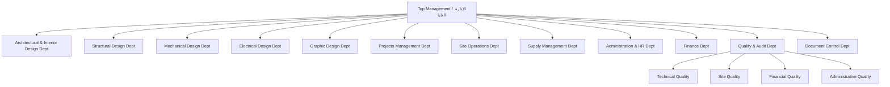

# Module 01: Identity & Authentication (الصلاحيات والمصادقة)

## 1. Executive Overview

| Attribute | Value |
|-----------|-------|
| **Priority** | Critical - Foundation for all modules |
| **Duration** | 2 weeks |
| **Budget** | 25% (23,750 LYD) |
| **Technology** | ASP.NET Core Identity (Custom) |
| **Dependencies** | None |

## 2. Organizational Structure

### 2.1 Department Hierarchy (Tree)



### 2.2 Department Entity (DBML)

```dbml
Table Department {
  id int [pk, increment]
  name varchar(255) [not null, note: 'Arabic name']
  parent_department_id int [null, ref: > Department.id]
  description text [null]
  is_active boolean [not null, default: true]
  created_at datetime [not null, default: `now()`]

  Note: 'Tree structure: Parent + Sub-departments. Changed from "Branch" to "Department" per request.'
}
```

## 3. User Types & Permission Matrix

### 3.1 User Type 1: Design Engineer (مهندس تصميم)

**Allowed:**
- [x] View own projects and tasks only
- [x] View timelines
- [x] Attendance check-in/out
- [x] View own salary, deductions, bonuses
- [x] Create supply requests
- [x] Document completed work
- [x] Project To-Do lists
- [x] Contact system admin

**Forbidden:**
- [ ] View budgets
- [ ] View owner/client data
- [ ] View general financial data
- [ ] View other employees' projects
- [ ] Edit/delete projects
- [ ] View general quality reports

### 3.2 User Type 2: Quality Engineer (مهندس جودة)

**Allowed:**
- [x] Add projects and tasks
- [x] Monitor all projects
- [x] Monitor design engineers' work
- [x] View all tasks
- [x] View timelines
- [x] Attendance check-in/out
- [x] Approve quality and reports
- [x] Can have Design + Quality permissions combined

**Forbidden:**
- [ ] View budgets
- [ ] View owner/client data
- [ ] View general financial data

### 3.3 User Type 3: System Admin (مدير النظام)

**Full Permissions:**
- [x] Manage all departments
- [x] Control permissions
- [x] Manage finance
- [x] Manage salaries
- [x] Approve deductions and bonuses
- [x] Approve projects
- [x] Manage reports
- [x] Full data access
- [x] **Manual permission override per employee**
- [x] Add/edit/delete permissions as needed

## 4. Database Schema (DBML)

### 4.1 Core Identity Tables

```dbml
Table ApplicationUser {
  id string [pk, note: 'IdentityUser.Id']
  full_name varchar(255) [not null]
  job_number varchar(50) [null]
  personal_id varchar(50) [null]
  profile_photo_path varchar(500) [null]
  documents_path varchar(500) [null]
  department_id int [null, ref: > Department.id]
  responsibilities text [null]
  rank varchar(50) [not null, note: 'JobRank enum']
  career_track varchar(50) [not null, note: 'CareerTrack enum']
  pledge text [null]
  contract_salary decimal(18,2) [not null, default: 0]
  contract_start_date date [null]
  contract_end_date date [null]
  monthly_evaluation_date date [null]
  yearly_evaluation_date date [null]
  contract_termination_date date [null]
  expected_location_name varchar(255) [null]
  expected_latitude double [null]
  expected_longitude double [null]
  allowed_radius_meters int [not null, default: 100]
  is_active boolean [not null, default: true]
  created_at datetime [not null, default: `now()`]

  Note: 'Extends IdentityUser. Supports multiple positions via EmployeePosition table.'
}

Table ApplicationRole {
  id string [pk, note: 'IdentityRole.Id']
  name varchar(256) [not null]
  description text [null]
  is_template boolean [not null, default: false, note: 'Protected roles: Admin, Design Engineer, Quality Engineer']
  can_delete boolean [not null, default: true]
  created_at datetime [not null, default: `now()`]
}

Table Permission {
  id int [pk, increment]
  name varchar(255) [not null]
  code varchar(100) [not null, unique]
  description text [null]
  module varchar(100) [not null, note: 'HR, Finance, Projects, Site, Supply, CRM, Quality, Reports']
  is_active boolean [not null, default: true]
}

Table RolePermission {
  id int [pk, increment]
  role_id string [not null, ref: > ApplicationRole.id]
  permission_id int [not null, ref: > Permission.id]
  is_granted boolean [not null, default: true]
}

Table EmployeePosition {
  id int [pk, increment]
  user_id string [not null, ref: > ApplicationUser.id]
  department_id int [not null, ref: > Department.id]
  rank varchar(50) [not null, note: 'JobRank enum']
  track varchar(50) [not null, note: 'CareerTrack enum']
  start_date date [not null]
  end_date date [null]
  is_primary boolean [not null, default: true]

  Note: 'Supports multiple positions per employee across different departments'
}
```

## 5. Enums (C# Style)

### 5.1 JobRank (الرتب الوظيفية)

```csharp
public enum JobRank
{
    // Engineering Track
    E0_TraineeEngineer = 0,      // 500-1,000 LYD
    E1_JuniorEngineer = 1,       // 1,000-1,800 LYD, +10%
    E2_Engineer = 2,             // 1,800-2,500 LYD, +10-15%
    E3_SeniorLeadEngineer = 3,   // 2,500-3,500 LYD, +15-20%
    E4_SpecializedEngineer = 4,  // 3,000-6,000 LYD, performance-based
    E5_EngineeringManager = 5,   // 5,000-7,000 LYD, +20-25%

    // Architecture Track
    AI0_TraineeArchitect = 10,   // 500-1,000 LYD
    AI1_JuniorArchitect = 11,    // 1,200-2,000 LYD, +10%
    AI2_Architect = 12,          // 3,000-4,000 LYD, +10-15%
    AI3_SeniorLeadArchitect = 13,// 4,000-5,000 LYD, +15-20%

    // Administrative Track
    M0_Trainee = 20,             // 200-500 LYD
    M1_Employee = 21,            // 1,200-1,800 LYD, +5-10%
    M2_Supervisor = 22,          // 1,800-2,500 LYD, +10-15%
    M3_Manager = 23,             // 2,500-3,000 LYD, +15-20%
    M4_HeadOfDepartment = 24,    // 3,000-6,000 LYD, +20-25%
    M5_CEO = 25,                 // 6,000-10,000 LYD, contract-based
    M6_Chairman = 26             // 10,000-20,000 LYD
}
```

### 5.2 CareerTrack

```csharp
public enum CareerTrack
{
    Engineering = 1,
    Architecture = 2,
    Administrative = 3
}
```

## 6. Permissions Catalog (47+ Permissions)

### 6.1 General Permissions

| # | Code | Arabic Name | Description |
|---|------|-------------|-------------|
| 1 | `Users.View` | المستخدمين.عرض | View user list |
| 2 | `Users.Create` | المستخدمين.إضافة | Add new user |
| 3 | `Users.Edit` | المستخدمين.تعديل | Edit user data |
| 4 | `Users.Delete` | المستخدمين.حذف | Delete/disable user |
| 5 | `Users.ToggleActive` | المستخدمين.تفعيل | Activate/deactivate account |

### 6.2 Role Permissions

| # | Code | Arabic Name |
|---|------|-------------|
| 6 | `Roles.View` | الأدوار.عرض |
| 7 | `Roles.Create` | الأدوار.إضافة |
| 8 | `Roles.Edit` | الأدوار.تعديل |
| 9 | `Roles.Delete` | الأدوار.حذف |
| 10 | `Roles.ManagePermissions` | الأدوار.تخصيص_صلاحيات |

### 6.3 Project Permissions

| # | Code | Arabic Name |
|---|------|-------------|
| 11 | `Projects.ViewAll` | المشاريع.عرض_الكل |
| 12 | `Projects.ViewOwn` | المشاريع.عرض_الخاصة |
| 13 | `Projects.Create` | المشاريع.إضافة |
| 14 | `Projects.Edit` | المشاريع.تعديل |
| 15 | `Projects.Delete` | المشاريع.حذف |
| 16 | `Projects.Stages.Manage` | المشاريع.مراحل.إدارة |
| 17 | `Projects.Tasks.Manage` | المشاريع.مهام.إدارة |
| 18 | `Projects.Costs.View` | المشاريع.تكاليف.عرض |
| 19 | `Projects.Costs.Edit` | المشاريع.تكاليف.تعديل |

### 6.4 Finance Permissions

| # | Code | Arabic Name |
|---|------|-------------|
| 20 | `Finance.View` | المالية.عرض |
| 21 | `Finance.Costs.View` | المالية.تكاليف.عرض |
| 22 | `Finance.Costs.Edit` | المالية.تكاليف.تعديل |
| 23 | `Finance.Sales.View` | المالية.مبيعات.عرض |
| 24 | `Finance.Sales.Edit` | المالية.مبيعات.تعديل |
| 25 | `Finance.Reports` | المالية.تقارير |
| 26 | `Finance.Print` | المالية.طباعة |

### 6.5 HR Permissions

| # | Code | Arabic Name |
|---|------|-------------|
| 27 | `HR.View` | الموارد_البشرية.عرض |
| 28 | `HR.Attendance.View` | الموارد_البشرية.حضور.عرض |
| 29 | `HR.Attendance.Edit` | الموارد_البشرية.حضور.تعديل |
| 30 | `HR.Salaries.View` | الموارد_البشرية.رواتب.عرض |
| 31 | `HR.Salaries.Edit` | الموارد_البشرية.رواتب.تعديل |
| 32 | `HR.Leaves.Manage` | الموارد_البشرية.إجازات.إدارة |
| 33 | `HR.Evaluation` | الموارد_البشرية.تقييم |

### 6.6 Supply Permissions

| # | Code | Arabic Name |
|---|------|-------------|
| 34 | `Supply.View` | التوريدات.عرض |
| 35 | `Supply.Create` | التوريدات.إضافة |
| 36 | `Supply.Approve` | التوريدات.موافقة |

### 6.7 Site Permissions

| # | Code | Arabic Name |
|---|------|-------------|
| 37 | `Sites.View` | المواقع.عرض |
| 38 | `Sites.Reports` | المواقع.تقارير |

### 6.8 PR/CRM Permissions

| # | Code | Arabic Name |
|---|------|-------------|
| 39 | `PR.View` | العلاقات_العامة.عرض |
| 40 | `PR.Contracts` | العلاقات_العامة.عقود |
| 41 | `PR.Clients` | العلاقات_العامة.عملاء |

### 6.9 Quality Permissions

| # | Code | Arabic Name |
|---|------|-------------|
| 42 | `Quality.View` | الجودة.عرض |
| 43 | `Quality.Reports` | الجودة.تقارير |
| 44 | `Quality.Approve` | الجودة.اعتماد |

### 6.10 Reports & Notifications

| # | Code | Arabic Name |
|---|------|-------------|
| 45 | `Reports.View` | التقارير.عرض |
| 46 | `Reports.Export` | التقارير.تصدير |
| 47 | `Notifications.Manage` | الإشعارات.إدارة |

## 7. GPS Attendance System

### 7.1 Haversine Formula (Location Verification)

```csharp
public static double CalculateDistance(double lat1, double lon1, double lat2, double lon2)
{
    const double R = 6371000; // Earth radius in meters
    var dLat = ToRadians(lat2 - lat1);
    var dLon = ToRadians(lon2 - lon1);
    var a = Math.Sin(dLat / 2) * Math.Sin(dLat / 2) +
            Math.Cos(ToRadians(lat1)) * Math.Cos(ToRadians(lat2)) *
            Math.Sin(dLon / 2) * Math.Sin(dLon / 2);
    var c = 2 * Math.Atan2(Math.Sqrt(a), Math.Sqrt(1 - a));
    return R * c;
}
```

### 7.2 Location Fields per User

| Field | Type | Description |
|-------|------|-------------|
| `ExpectedLocationName` | string | Work location name |
| `ExpectedLatitude` | double? | GPS latitude |
| `ExpectedLongitude` | double? | GPS longitude |
| `AllowedRadiusMeters` | int | Default: 100m |

## 8. Business Rules (قواعد العمل)

1. **Protected Roles**: Admin, Design Engineer, Quality Engineer roles CANNOT be deleted (`IsTemplate = true`, `CanDelete = false`).
2. **Last Admin Protection**: Cannot delete the last Admin user in the system.
3. **Department Required**: Every user must be linked to at least one department.
4. **Multiple Positions**: An employee can hold multiple positions across different departments.
5. **Permission Overlay**: Effective permissions = Role permissions UNION Manual employee overrides.
6. **Inactive Block**: Inactive employees (`IsActive = false`) cannot log in.
7. **Instant Permission Apply**: Permission changes apply immediately without re-login.
8. **GPS Configurable**: Work location is set in employee file and editable by Admin only.

## 9. Features Checklist

### 9.1 Authentication
- [x] RTL Login page
- [x] Remember Me
- [x] Password reset
- [x] Account lock after 5 failed attempts
- [x] Arabic error messages

### 9.2 User Management (Admin only)
- [x] View users list with filtering
- [x] Add new user
- [x] Edit user data
- [x] Toggle Active/Inactive
- [x] View full profile
- [x] Link user to department + rank + career track
- [x] Assign multiple positions/departments

### 9.3 Role Management
- [x] View roles list
- [x] Create custom role
- [x] Edit role
- [x] Delete role (protected templates cannot be deleted)
- [x] Assign/remove permissions to role

### 9.4 Permission Management
- [x] View permissions grouped by module
- [x] Toggle permission for role
- [x] **Manual permission override per employee**
- [x] Copy permissions from one role to another

### 9.5 Department Management
- [x] Add/edit/delete departments
- [x] Tree structure (parent + sub-departments)
- [x] Link employees to departments
- [x] Rename "Branch" to "Department"

### 9.6 Dashboard
- [x] Total users count
- [x] Active users count
- [x] Total roles count
- [x] Total permissions count
- [x] Latest registered users
- [x] Users distribution by department

## 10. Seed Data

### 10.1 Default Admin User

```json
{
  "email": "admin@athar.ly",
  "password": "Athar@Admin2026",
  "role": "Admin",
  "fullName": "مدير النظام",
  "isActive": true
}
```

### 10.2 Template Roles

| Role Name | IsTemplate | CanDelete | Description |
|-----------|------------|-----------|-------------|
| Admin | true | false | Full system control |
| Design Engineer | true | false | Design permissions set |
| Quality Engineer | true | false | Quality permissions set |

### 10.3 Default Departments

1. الإدارة العليا (Top Management)
2. قسم التصميم المعماري والداخلي
3. قسم التصميم الإنشائي
4. قسم التصميم الميكانيكي
5. قسم التصميم الكهربائي
6. قسم التصميم الجرافيكي
7. قسم إدارة المشاريع
8. قسم إدارة العمليات الميدانية
9. قسم إدارة التوريدات
10. قسم شؤون الإدارة والموارد البشرية
11. قسم المالية
12. قسم الجودة والتدقيق
13. قسم Document Control

## 11. Implementation Notes

- **No ViewModels**: Pass Models directly to Views.
- **Use `[Bind]` in Controllers**.
- **RTL**: All pages Arabic right-to-left.
- **Colors**: Brown/Amber matching Athar company identity.
- **Font**: Appropriate Arabic font.
- **Schema**: Identity tables in schema named "identity".
- **All entities** carry `[Display]` attributes in Arabic.
