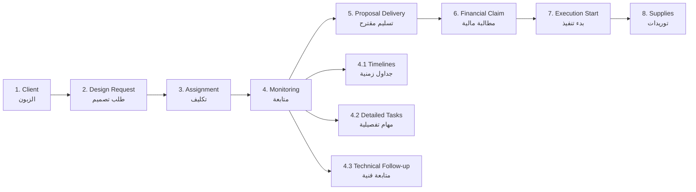

# Module 02: Project Management (إدارة المشاريع)

## 1. Executive Overview

| Attribute | Value |
|-----------|-------|
| **Priority** | Critical |
| **Duration** | 3 weeks (Weeks 3-5) |
| **Budget** | 12.5% (11,875 LYD) |
| **Dependencies** | Module 01 (Identity) |

## 2. Project Hierarchy

### 2.1 Structural Diagram

```
Main Project (مشروع رئيسي)
├── Sub-Project 1 (مشروع فرعي)
│   ├── Stages (مراحل)
│   │   ├── Steps (خطوات)
│   │   │   └── Tasks (مهام)
│   │   └── Costs (تكاليف)
│   │       └── Sub-Tasks (مهام فرعية)
│   └── Team (فريق العمل)
├── Sub-Project 2
│   └── ...
└── Main Team
```

### 2.2 Hierarchy Rules

1. **Sub-project is independent**: Has independent timeline, team, completion percentages.
2. **Main project aggregates**: Collects tasks, costs, timelines, and teams from all sub-projects.
3. **Auto-copy**: When a task is created in a sub-project, it auto-copies to the main project.
4. **Privacy**: Display **project name and code only** — hide owner/client name from unauthorized users.
5. **Project Code Format**: `PRJ-YYYY-NNN` (e.g., `PRJ-2026-001`).
6. **Auto-sequencing**: Starts from 001 each year.

## 3. Database Schema (DBML)

### 3.1 Client Entity

```dbml
Table Client {
  id int [pk, increment]
  name varchar(255) [not null, note: 'Client name - HIDDEN from unauthorized users']
  company_name varchar(255) [null]
  phone varchar(50) [null]
  email varchar(255) [null]
  address text [null]
  tax_number varchar(50) [null]
  notes text [null]
  is_active boolean [not null, default: true]
  created_at datetime [not null, default: `now()`]
}
```

### 3.2 Project Entity

```dbml
Table Project {
  id int [pk, increment]
  code varchar(50) [not null, unique, note: 'PRJ-YYYY-NNN format']
  name varchar(255) [not null]
  description text [null]
  client_id int [not null, ref: > Client.id]
  parent_project_id int [null, ref: > Project.id, note: 'NULL = Main project']
  type varchar(50) [not null, note: 'Main=1, Sub=2']
  status varchar(50) [not null, default: 'New', note: 'New=1, InProgress=2, OnHold=3, Completed=4, Cancelled=5']
  planned_start_date date [null]
  planned_end_date date [null]
  actual_start_date date [null]
  actual_end_date date [null]
  completion_percentage decimal(5,2) [not null, default: 0, note: 'Auto-calculated']
  budget decimal(18,2) [null]
  actual_cost decimal(18,2) [not null, default: 0]
  priority varchar(50) [not null, default: 'Normal', note: 'Low=1, Normal=2, High=3, Critical=4']
  is_urgent boolean [not null, default: false]
  created_at datetime [not null, default: `now()`]
  created_by_id string [not null, ref: > ApplicationUser.id]
}
```

### 3.3 Project Stage Entity

```dbml
Table ProjectStage {
  id int [pk, increment]
  project_id int [not null, ref: > Project.id]
  name varchar(255) [not null]
  sequence int [not null, note: 'Display order']
  weight decimal(5,2) [not null, note: 'Percentage of total project. Sum of all stages = 100%']
  status varchar(50) [not null, default: 'New', note: 'New=1, InProgress=2, ClientReview=3, Completed=4, Delayed=5']
  cost decimal(18,2) [null, note: 'Allocated cost']
  actual_cost decimal(18,2) [not null, default: 0]
  completion_percentage decimal(5,2) [not null, default: 0, note: 'Auto-calculated']
  assigned_engineer_id string [null, ref: > ApplicationUser.id]
  department_id int [null, ref: > Department.id, note: 'Arch, Interior, Structural, Mechanical, Electrical']
  planned_start_date date [null]
  planned_end_date date [null]
  actual_start_date date [null]
  actual_end_date date [null]
  work_documentation text [null, note: 'Periodic work documentation']
}
```

### 3.4 Project Step Entity

```dbml
Table ProjectStep {
  id int [pk, increment]
  stage_id int [not null, ref: > ProjectStage.id]
  name varchar(255) [not null]
  weight decimal(5,2) [not null, note: 'Percentage within stage. Sum of all steps in stage = 100%']
  status varchar(50) [not null, default: 'NotStarted', note: 'NotStarted=1, InProgress=2, Completed=3']
  actual_cost decimal(18,2) [not null, default: 0]
  completed_date datetime [null]
  completed_by_id string [null, ref: > ApplicationUser.id]
}
```

### 3.5 Project Task Entity

```dbml
Table ProjectTask {
  id int [pk, increment]
  project_id int [not null, ref: > Project.id]
  stage_id int [null, ref: > ProjectStage.id]
  title varchar(255) [not null]
  description text [null]
  due_date date [null]
  planned_start_date date [null]
  planned_end_date date [null]
  actual_delivery_date date [null]
  delay_days int [not null, default: 0, note: 'Auto: ActualDelivery - PlannedEnd (if > 0)']
  early_delivery_days int [not null, default: 0, note: 'Auto: PlannedEnd - ActualDelivery (if > 0)']
  priority varchar(50) [not null, default: 'Medium', note: 'Low=1, Medium=2, High=3, Critical=4']
  status varchar(50) [not null, default: 'NotStarted', note: 'NotStarted=1, InProgress=2, Completed=3, Blocked=4']
  is_urgent boolean [not null, default: false, note: 'Separate from priority']
  completion_percentage decimal(5,2) [not null, default: 0, note: 'Based on To-Do list']
  bonus_amount decimal(18,2) [not null, default: 0]
  penalty_amount decimal(18,2) [not null, default: 0]
  created_at datetime [not null, default: `now()`]
  created_by_id string [not null, ref: > ApplicationUser.id]
}
```

### 3.6 Task Assignee (Multiple Engineers per Task)

```dbml
Table TaskAssignee {
  id int [pk, increment]
  task_id int [not null, ref: > ProjectTask.id]
  user_id string [not null, ref: > ApplicationUser.id]
  contribution_percentage decimal(5,2) [not null, default: 100, note: 'Contribution % per engineer']
  assigned_at datetime [not null, default: `now()`]

  Note: 'Multiple engineers can be assigned to same task with contribution split'
}
```

### 3.7 Task To-Do List

```dbml
Table TaskTodo {
  id int [pk, increment]
  task_id int [not null, ref: > ProjectTask.id]
  item varchar(500) [not null]
  is_completed boolean [not null, default: false]
  completed_at datetime [null]
}
```

### 3.8 Task Dependencies

```dbml
Table TaskDependency {
  id int [pk, increment]
  task_id int [not null, ref: > ProjectTask.id, note: 'The dependent task']
  depends_on_task_id int [not null, ref: > ProjectTask.id, note: 'The prerequisite task']
  type varchar(50) [not null, default: 'FinishToStart', note: 'FinishToStart, StartToStart, FinishToFinish, StartToFinish']

  Note: 'Blocks task start until all dependencies are completed'
}
```

### 3.9 Project Cost Entity

```dbml
Table ProjectCost {
  id int [pk, increment]
  project_id int [not null, ref: > Project.id]
  cost_type varchar(100) [not null, note: 'معماري، داخلي، إنشائي، ميكانيكي، كهربائي']
  description text [null]
  area decimal(18,2) [null, note: 'm²']
  price_per_meter decimal(18,2) [null]
  amount decimal(18,2) [not null]
  discount_or_addition_percent decimal(5,2) [not null, default: 0]
  final_amount decimal(18,2) [not null]
  status varchar(50) [not null, default: 'Pending', note: 'Pending=1, InProgress=2, Completed=3, Cancelled=4']
  is_transferred_to_finance boolean [not null, default: false, note: 'Auto-set on completion']
  transferred_to_finance_at datetime [null]
  created_at datetime [not null, default: `now()`]
}
```

### 3.10 Project Cost Subtask

```dbml
Table ProjectCostSubtask {
  id int [pk, increment]
  project_cost_id int [not null, ref: > ProjectCost.id]
  name varchar(255) [not null]
  is_completed boolean [not null, default: false]
  completed_at datetime [null]
}
```

### 3.11 Project Team Member

```dbml
Table ProjectTeamMember {
  id int [pk, increment]
  project_id int [not null, ref: > Project.id]
  user_id string [not null, ref: > ApplicationUser.id]
  role varchar(50) [not null, default: 'Member', note: 'ProjectManager=1, LeadEngineer=2, Engineer=3, Member=4']
  joined_at datetime [not null, default: `now()`]
}
```

### 3.12 Project Document

```dbml
Table ProjectDocument {
  id int [pk, increment]
  project_id int [not null, ref: > Project.id]
  file_name varchar(255) [not null]
  file_path varchar(500) [not null]
  file_type varchar(50) [null, note: 'image, pdf, dwg, docx']
  file_size bigint [not null, default: 0]
  description text [null]
  uploaded_at datetime [not null, default: `now()`]
  uploaded_by_id string [not null, ref: > ApplicationUser.id]
}
```

### 3.13 Project Timeline (Gantt)

```dbml
Table ProjectTimeline {
  id int [pk, increment]
  project_id int [not null, ref: > Project.id]
  title varchar(255) [not null]
  description text [null]
  start_date datetime [not null]
  end_date datetime [not null]
  color varchar(20) [not null, default: '#3788d8']
  type varchar(50) [not null, default: 'Milestone', note: 'Stage=1, Task=2, Milestone=3']
}
```

## 4. Enums (C# Style)

### 4.1 ProjectType
```csharp
public enum ProjectType
{
    [Display(Name = "مشروع رئيسي")] Main = 1,
    [Display(Name = "مشروع فرعي")] Sub = 2
}
```

### 4.2 ProjectStatus
```csharp
public enum ProjectStatus
{
    [Display(Name = "جديد")] New = 1,
    [Display(Name = "قيد التنفيذ")] InProgress = 2,
    [Display(Name = "متوقف مؤقتاً")] OnHold = 3,
    [Display(Name = "مكتمل")] Completed = 4,
    [Display(Name = "ملغى")] Cancelled = 5
}
```

### 4.3 Priority
```csharp
public enum Priority
{
    [Display(Name = "منخفضة")] Low = 1,
    [Display(Name = "عادية")] Normal = 2,
    [Display(Name = "عالية")] High = 3,
    [Display(Name = "حرجة")] Critical = 4
}
```

### 4.4 StageStatus
```csharp
public enum StageStatus
{
    [Display(Name = "جديدة")] New = 1,
    [Display(Name = "قيد التنفيذ")] InProgress = 2,
    [Display(Name = "مراجعة العميل")] ClientReview = 3,
    [Display(Name = "مكتملة")] Completed = 4,
    [Display(Name = "متأخرة")] Delayed = 5
}
```

### 4.5 StepStatus
```csharp
public enum StepStatus
{
    [Display(Name = "لم تبدأ")] NotStarted = 1,
    [Display(Name = "قيد التنفيذ")] InProgress = 2,
    [Display(Name = "مكتملة")] Completed = 3
}
```

### 4.6 TaskPriority
```csharp
public enum TaskPriority
{
    [Display(Name = "منخفضة")] Low = 1,
    [Display(Name = "متوسطة")] Medium = 2,
    [Display(Name = "عالية")] High = 3,
    [Display(Name = "حرجة")] Critical = 4
}
```

### 4.7 TaskStatus
```csharp
public enum TaskStatus
{
    [Display(Name = "لم تبدأ")] NotStarted = 1,
    [Display(Name = "قيد التنفيذ")] InProgress = 2,
    [Display(Name = "مكتملة")] Completed = 3,
    [Display(Name = "محظورة")] Blocked = 4
}
```

### 4.8 TeamRole
```csharp
public enum TeamRole
{
    [Display(Name = "مدير المشروع")] ProjectManager = 1,
    [Display(Name = "مهندس رئيسي")] LeadEngineer = 2,
    [Display(Name = "مهندس")] Engineer = 3,
    [Display(Name = "عضو")] Member = 4
}
```

### 4.9 TimelineType
```csharp
public enum TimelineType
{
    [Display(Name = "مرحلة")] Stage = 1,
    [Display(Name = "مهمة")] Task = 2,
    [Display(Name = "حدث رئيسي")] Milestone = 3
}
```

### 4.10 CostStatus
```csharp
public enum CostStatus
{
    [Display(Name = "معلق")] Pending = 1,
    [Display(Name = "قيد التنفيذ")] InProgress = 2,
    [Display(Name = "مكتمل")] Completed = 3,
    [Display(Name = "ملغى")] Cancelled = 4
}
```

## 5. Auto-Calculations (الحسابات التلقائية)

### 5.1 Project Code Generation
```
Format: PRJ-YYYY-NNN
Example: PRJ-2026-001, PRJ-2026-002
- YYYY = Current year
- NNN = Auto-increment (resets to 001 each year)
```

### 5.2 Stage Completion Percentage
```
Stage Completion % = Σ(Completed Steps Weight) / Total Stage Weight × 100
```

### 5.3 Project Completion Percentage
```
Project Completion % = Σ(Stage Completion % × Stage Weight) / 100
```

### 5.4 Delay Days
```
IF ActualDeliveryDate > PlannedEndDate:
    DelayDays = ActualDeliveryDate - PlannedEndDate
ELSE:
    DelayDays = 0
```

### 5.5 Early Delivery Days
```
IF ActualDeliveryDate < PlannedEndDate:
    EarlyDeliveryDays = PlannedEndDate - ActualDeliveryDate
ELSE:
    EarlyDeliveryDays = 0
```

### 5.6 Task Completion (To-Do Based)
```
Task Completion % = (Completed Todos / Total Todos) × 100
```

### 5.7 Auto-Transfer to Finance
```
ON CostStatus CHANGED TO "Completed":
    1. Create financial record automatically
    2. Columns: CostType, Area, Value, Status (Cleared/Not Cleared)
    3. Update project total costs
    4. Notify finance department
```

## 6. Business Rules (قواعد العمل)

### 6.1 Stage Weight Rules
1. Sum of all stage weights within a project MUST equal 100%.
2. Stage completion = sum of completed step weights / total stage weight.
3. Project completion = weighted average of all stages.

### 6.2 Step Weight Rules
1. Sum of all step weights within a stage MUST equal 100% (enforced by system).
2. Completing a step auto-updates stage completion.
3. Completing a stage auto-updates project completion.

### 6.3 Task Assignment Rules
1. **Multiple engineers** can be assigned to the same task with contribution percentages.
2. **Auto-notification** sent when task is assigned to engineer.
3. **Past-date tasks** allowed for archiving (Admin only).
4. **IsUrgent** is separate from Priority field.

### 6.4 Dependency Rules
1. Cannot start a task until all prerequisite tasks are completed.
2. System prevents changing task status to "InProgress" if dependencies are incomplete.
3. Dependency graph available per project.

### 6.5 Cost Rules
1. Dedicated cost section inside each project.
2. Sub-tasks inside each cost item.
3. On cost completion → auto-transfer to finance tables.
4. Transfer columns: CostType, Area, Value, Status.

### 6.6 Privacy & Security Rules
1. **Hide owner name**: Show project name and code only. Hide client name from unauthorized users.
2. **Project isolation**: Each engineer sees own projects only (except Quality engineers and Admin).
3. **Financial isolation**: Design engineers cannot view financial costs.
4. **Audit log**: Log every add/edit/delete with user and timestamp.

## 7. Project Workflow (سير العمل)



### 7.1 Workflow Details

| Stage | Description | Key Actions |
|-------|-------------|-------------|
| **1. Client** | Add client data, link to project | Create client record |
| **2. Design Request** | Types: Architectural, Interior, Structural, MEP | Define scope of work |
| **3. Assignment** | Assign to one or more engineers | Set requirements, notify engineer |
| **4. Monitoring** | Track timelines, tasks, technical approval | Calculate early/late delivery |
| **5. Proposal Delivery** | Multiple proposals possible until approval | After admin + client approval → finance |
| **6. Financial Claim** | First design proposal gets invoice | Project name, item, area, price/m², total |
| **7. Execution Start** | Site monitoring and requirements | Site operations begin |
| **8. Supplies** | Supply requests and installation supervision | Link to Supply Module |

## 8. Design Types Supported

| # | Type | Code | Department |
|---|------|------|------------|
| 1 | Architectural & Exterior | Architectural | التصميم المعماري |
| 2 | Interior & Layout | Interior | التصميم الداخلي |
| 3 | Structural | Structural | التصميم الإنشائي |
| 4 | Mechanical | Mechanical | التصميم الميكانيكي |
| 5 | Electrical | Electrical | التصميم الكهربائي |
| 6 | Graphic | Graphic | التصميم الجرافيكي |

## 9. Dashboards

### 9.1 Project Completion Dashboard
- [x] Total projects count
- [x] Completed projects
- [x] In-progress projects
- [x] Delayed projects
- [x] Completion percentages per project
- [x] Project distribution by status

### 9.2 Team Dashboard
- [x] Team members per project
- [x] Task distribution by employee
- [x] Completion percentages by employee
- [x] Urgent tasks
- [x] Delayed tasks

### 9.3 Kanban Board per Stage
- [x] Columns: Not Started / In Progress / Completed / Blocked
- [x] Drag & Drop
- [x] Status change by click
- [x] Quick detail view

## 10. Notifications (from Module 02)

| # | Event | Recipients | Type | Source |
|---|-------|------------|------|--------|
| 1 | New task assigned | Assigned engineer | Instant | Module 02 |
| 2 | Task status changed | Project manager + team | Instant | Module 02 |
| 3 | Stage completed | Admin + project team | Instant | Module 02 |
| 4 | Task delayed | Project manager | Instant | Module 02 |
| 5 | New supply request | Admin | Instant | Module 02 |
| 6 | Delivery approaching (48h) | Responsible engineer | Before 48h | Module 02 |
| 7 | Cost completed (for finance) | Finance department | Instant | Module 02 |

## 11. Features Checklist

### 11.1 Client Management
- [x] Add/edit/delete/view clients
- [x] Search and filter clients
- [x] View projects per client
- [x] Basic data only (no portal login here — added in CRM module)

### 11.2 Project Management
- [x] Create main and sub-projects
- [x] Auto-generate project code `PRJ-YYYY-NNN`
- [x] Link to client
- [x] Set timeline (planned/actual)
- [x] Track budget vs actual cost
- [x] Set priority and urgency
- [x] Archive completed projects

### 11.3 Stage Management
- [x] Create stages with weights (sum = 100%)
- [x] Assign to department and engineer
- [x] Track status: New → InProgress → ClientReview → Completed
- [x] Document periodic work

### 11.4 Step Management
- [x] Create steps within stages (sum = 100%)
- [x] Track completion
- [x] Auto-update stage completion

### 11.5 Task Management
- [x] Create tasks with multiple assignees
- [x] Set due dates and priorities
- [x] To-Do list inside each task
- [x] Track delay/early delivery days (auto)
- [x] Block status for dependencies
- [x] Bonus/penalty tracking

### 11.6 Cost Management
- [x] Add costs by type (Architectural, Interior, etc.)
- [x] Calculate area × price per meter
- [x] Apply discount/addition percentage
- [x] Sub-tasks inside costs
- [x] Auto-transfer to finance on completion

### 11.7 Document Management
- [x] Upload files (images, PDF, DWG, DOCX)
- [x] Archive and save files
- [x] Organize by file type

### 11.8 Timeline / Gantt
- [x] Visual timeline per project
- [x] Compare planned vs actual dates
- [x] Auto-calculate delay days
- [x] Timeline report
- [x] Periodic work documentation

## 12. Implementation Notes

- **No ViewModels**: Pass Models directly to Views.
- **Use `[Bind]` in Controllers**.
- **RTL**: All pages Arabic right-to-left.
- **Colors**: Brown/Amber matching Athar company identity.
- **Reports**: Printable and exportable PDF/Excel.
- **Search & Filter**: In all lists.
- **Auto-cumulative**: All calculation tables auto-cumulative.
- **Currency**: Libyan Dinar (LYD / د.ل).
